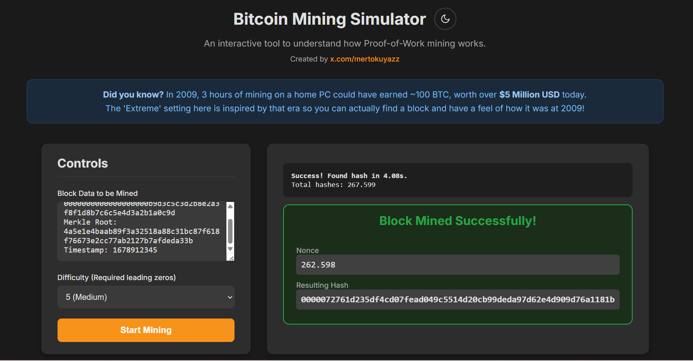

# Bitcoin Mining Simulator

[mertokuyaz.github.io](mertokuyaz.github.io)

Header Note:

This project was already shared at https://github.com/mertokuyaz/mertokuyaz.github.io/, but I wanted to create this repository for SEO purposes so that people can find it more easily.


An interactive, browser-based tool designed to visually and interactively explain the fundamental concept of Bitcoin mining and Proof-of-Work. This simulator allows users to see the "guess and check" process of finding a valid hash in real-time, right in their browser.

This project was created and conceptualized by [Mert Okuyaz](https://x.com/mertokuyazz).

Live Demo
[mertokuyaz.github.io](mertokuyaz.github.io)

  

## Features

-   **Interactive Mining:** Start and stop the mining process with a single button.
-   **Adjustable Difficulty:** Choose from multiple difficulty levels (number of leading zeros) to see how it dramatically affects the time required to find a hash.
-   **Real-time Statistics:** Get live feedback on key metrics:
    -   **Time Spent:** Total duration of the current mining attempt.
    -   **Hashes/sec:** The speed at which your computer is performing the SHA-256 hashing operations.
    -   **Estimated Time (ETA):** A statistical estimate of how long it might take to find a valid hash at the current rate and difficulty.
-   **Live Process Log:** See the mining process unfold with a log that shows the current nonce being checked and the resulting hash.
-   **Secure & Local:** Uses the browser's built-in [Web Crypto API](https://developer.mozilla.org/en-US/docs/Web/API/Web_Crypto_API) for high-performance, secure hashing. No data ever leaves your machine.
-   **Educational Sections:** Includes clear, concise explanations of how Bitcoin mining works and how the simulator mimics this process.
-   **Fully Responsive:** The layout is designed to work seamlessly on both desktop and mobile devices.

## How It Works

This simulator does not mine real Bitcoin, but it accurately replicates the core logic of the Proof-of-Work algorithm.

### The Mining Process (Proof-of-Work)

1.  **Data:** A miner bundles transaction data, a timestamp, and a reference to the previous block's hash into a "block header".
2.  **Nonce:** They add a number called a `nonce` (number used once) to this data. Initially, it's 0.
3.  **Hashing:** They run the combined data (block header + nonce) through the **SHA-256** cryptographic hash function. This produces a unique, fixed-length "fingerprint" called a hash.
4.  **Checking:** They check if this hash meets the network's current **difficulty target**. In our simulator, this is represented by a required number of leading zeros (e.g., `00000...`).
5.  **Iteration:** If the hash doesn't meet the target, they increment the nonce (`nonce++`) and go back to step 3. They repeat this process millions or billions of times per second.

The first miner to find a hash that meets the target "wins" the block, broadcasts their solution to the network, and collects the block reward.

### The Simulator's Role

The JavaScript code in `script.js` automates this process:

-   When you click **"Start Mining"**, it takes the content of the `Block Data` textarea.
-   It enters a high-speed loop, starting with `nonce = 0`.
-   In each iteration, it concatenates the `Block Data + nonce` and uses the **Web Crypto API** to compute the SHA-256 hash.
-   It checks if the hash starts with the required number of zeros based on the selected **Difficulty**.
-   If a valid hash is found, it stops and displays the winning `nonce` and `hash`.
-   If not, it continues to the next batch of nonces, updating the UI with live statistics along the way.

## Tech Stack

-   **HTML5:** For the structure and content of the application.
-   **CSS3:** For all styling, layout (Flexbox & Grid), and responsiveness.
-   **Modern JavaScript (ES6+):** For all the application logic, DOM manipulation, and handling the mining loop.
-   **Web Crypto API:** Used for performing the high-speed SHA-256 hashing required for the simulation.

## Getting Started

To run this project on your local machine, follow these steps.

### Prerequisites

You need a modern web browser that supports the Web Crypto API (Chrome, Firefox, Safari, Edge, etc.).

### Installation

1.  Clone the repository to your local machine:
    ```sh
    git clone https://github.com/your-username/bitcoin-mining-simulator.git
    ```
2.  Navigate into the project directory:
    ```sh
    cd bitcoin-mining-simulator
    ```
3.  Run a local web server in that directory.

    **Important:** The Web Crypto API (`crypto.subtle`) requires a secure context to run. This means you must serve the files from either `https://` or `localhost`. You **cannot** simply open the `index.html` file directly from your file system (e.g., `file:///...`).

    The easiest way to do this is with a simple development server. If you have Visual Studio Code, the **[Live Server](https://marketplace.visualstudio.com/items?itemName=ritwickdey.LiveServer)** extension is a perfect one-click solution.

    Alternatively, if you have Python installed, you can run:
    ```sh
    # For Python 3
    python -m http.server
    ```
    Then, open your browser and navigate to `http://localhost:8000`.

## License

This project is licensed under the MIT License.
